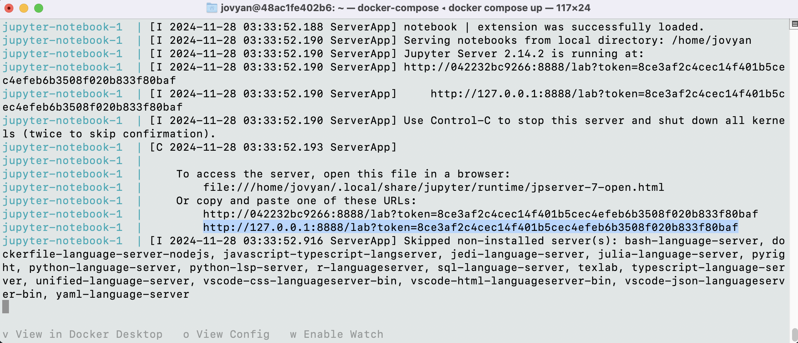

# Academic Success Prediction
- author: Jenson Chang, Jingyuan Wang, Catherine Meng, Siddarth Subrahmanian

Demo of a data analysis project for DSCI 522 (Data Science Workflows); a course in the Master of Data Science program at the University of British Columbia.

## About
Here we attempt to build a classification model using the k-nearest neighbours algorithm which can use the information known at the time of student enrollment (academic path, demographics, and social-economic factors) to predict students' dropout and academic sucess. Our final classifier performed consistently on unseen test data, achieving a cross-validation training score of 0.71, with a similar test score. Although the model's accuracy is moderate, it performs consistently. Given that the data was collected from a single institution, a larger dataset may be necessary to generalize predictions to other institutions or countries. We believe this model is close to supporting dropout prediction for the institution from which the data was collected, though further research to improve performance and better understand characteristics of incorrectly predicted students would still be beneficial.

The data set is created by Mónica Vieira Martins, Jorge Machado, Luís Baptista and Valentim Realinho at the Instituto Politécnico de Portalegre (M.V.Martins, D. Tolledo, J. Machado, L. M.T. Baptista, V.Realinho. 2021). It is sourced from UC Irvine's Machine Learning Repository and can be found here. The data contains demographic, enrollment and academic (1st and 2nd semesters) information on the students. Each row in the data set represents a student record. Using these data, a model would be built to predict the academic outcome of the student. There are 36 columns in total.

## Report
The final report can be found [here](./notebook/academic-success-prediction.ipynb).

## Dependencies
- [Docker](https://www.docker.com/products/docker-desktop/)

## Usage
**Run Jupyter Notebook**

1. Clone this GitHub repository

2. Navigate to the root of the project and run the following command with command line

    `docker compose up`

    This container will run Jupyter Notebook using the default port of 8888. Make sure no other applications are using this port. 

3. In the terminal, copy the Jupyter Notebook URL and token. It should start with 

    `http://127.0.01:8888/lab?token=` 

    

4. In Jupyter Notebook, navigate to the analysis file `academic-success-prediction.ipynb` and under the "Kernel" menu click "Restart Kernel and Run All Cells...".

**Run Python Script**
```
# Download the data and extract and save as csv file
python scripts/01_download_data.py \
    --url="https://archive.ics.uci.edu/static/public/697/predict+students+dropout+and+academic+success.zip" \
    --write_to=data/raw

# Check file type, do data cleaning and data validation
python scripts/02_data_cleaning_validation.py --file_path=data/raw/data.csv

# Perform exploratory data analysis and save figures
python scripts/03_eda.py --data_path="data/processed/train_data.csv" --figure_path="figures"
```
**Clean Up**

1. Press Ctrl + C in the terminal to shut down the Jupyter Notebook. 

2. Use the following command to remove the container. 

    `docker compose rm`

## License
The Academic Success Prediction report contained herein are licensed under the **Creative Commons Attribution 2.5 Canada License** ([CC BY 2.5 CA](https://creativecommons.org/licenses/by/2.5/ca/)). See the [license file](./LICENSE.md) for more information. . If re-using/re-mixing please provide attribution and link to this webpage. The software code contained within this repository is licensed under the MIT license. See the [license file](./LICENSE.md) for more information.

## Reference
1. Martins, M. V., D. Tolledo, J. Machado, L. M. T. Baptista, and V. Realinho. “Early Prediction of Student’s Performance in Higher Education: A Case Study.” In Trends and Applications in Information Systems and Technologies, vol. 1, Advances in Intelligent Systems and Computing series. Springer, 2021. https://archive.ics.uci.edu/dataset/697/predict+students+dropout+and+academic+success. DOI: 10.1007/978-3-030-72657-7_16.

2. Scikit-learn Developers. “Scikit-learn: Machine Learning in Python – API Reference Documentation.” Accessed November 20, 2024. https://scikit-learn.org/dev/api/index.html.

3. Vega-Altair Developers. “Altair User Guide.” Accessed November 20, 2024. https://altair-viz.github.io/user_guide/data.html#.

4. Timbers, T., J. Ostblom, and M. Lee. “Predicting Breast Cancer from Digitized Images of Breast Mass.” Accessed November 21, 2024. https://github.com/ttimbers/breast-cancer-predictor/blob/0.0.1/notebooks/breast_cancer_predictor_report.ipynb.